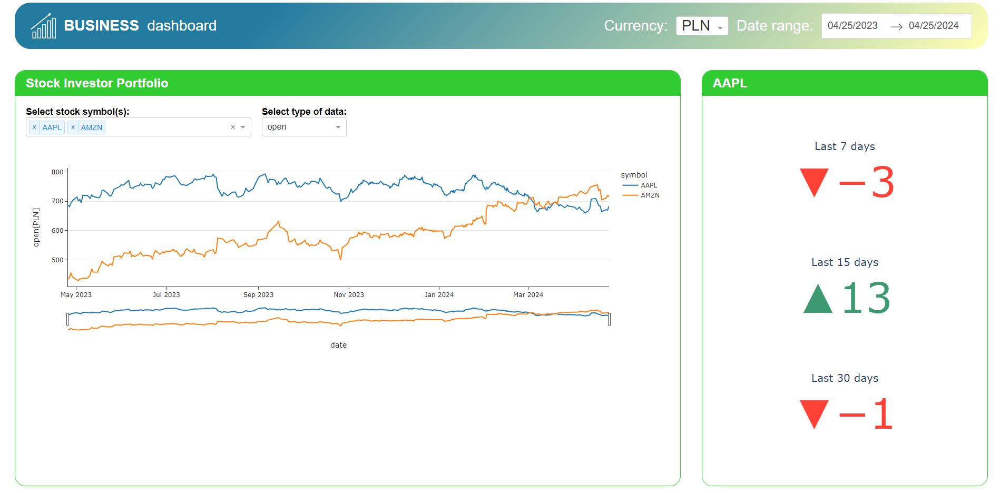
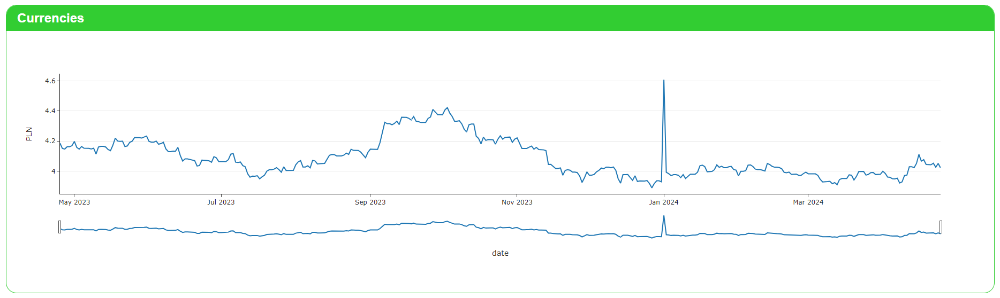
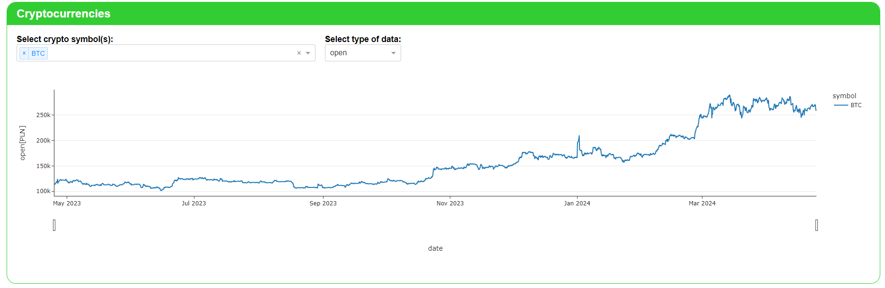

# Business Dashboard

Simple dashboard built with Plotly Dash. Data fetched from https://financialmodelingprep.com and https://openexchangerates.org. 
Dashboard visualizes: open, close, low, high and volume price for top 10 stocks and cryptocurrencies. It also shows prices for 7 currencies (PLN,EUR,USD,GBP,SEK,NOK,CHF,JPY). USD is base price.
Data is within range 2021-09-08 and 2024-04-25 for currencies and stock.
Cryptocurrencies is within date 2022-02-07 and 2024-04-25.

# Screenshots




# Getting started
1. Clone this repo
    ```
    git clone https://github.com/krzysztofhewelt/business-dashboard.git
    ```
2. Install packages
    ```
    pip install -r requirements.txt
    ```
3. Run dashboard
    ```
    python main.py
    ```
4. You can add more data by own in .csv files or fetch data.

# Used technologies
* Python 3.11
* Plotly
* Dash
* Pandas
* requests
